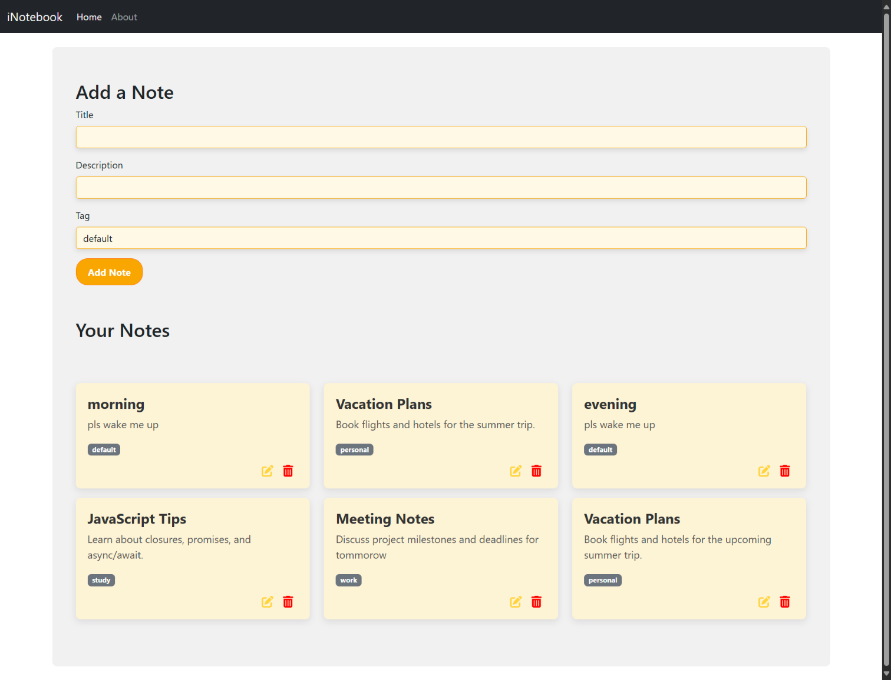

<h1>📓 MyNotesApp - Full Stack Note-Taking Application</h1>

A full-stack note-taking application with a React frontend and Spring Boot + MongoDB backend, providing CRUD operations for notes with a user-friendly interface.

<h2>🚀 Features</h2>
<ul>
  <li>📝 <strong>Create Notes</strong>: Add new notes with title, description, and tags</li>
  <li>👀 <strong>Read Notes</strong>: View all notes in a responsive grid layout</li>
  <li>✏️ <strong>Update Notes</strong>: Edit existing notes with instant updates</li>
  <li>🗑️ <strong>Delete Notes</strong>: Remove notes with confirmation</li>
  <li>✅ <strong>Form Validation</strong>: Client-side validation for note content</li>
  <li>📱 <strong>Responsive Design</strong>: Works on both desktop and mobile devices</li>
  <li>🖼️ <strong>Sticky Note UI</strong>: Colorful card-based interface with hover effects</li>
  <li>⚠️ <strong>Error Handling</strong>: Clear error messages for failed operations</li>
</ul>

<h2>🛠️ Technologies Used</h2>

<h3>Frontend</h3>
<ul>
  <li>⚛️ React (v18+)</li>
  <li>🧭 React Router</li>
  <li>🖌️ Bootstrap 5</li>
  <li>🖼️ Font Awesome Icons</li>
  <li>🌐 HTML5/CSS3</li>
</ul>

<h3>Backend</h3>
<ul>
  <li>☕ Spring Boot </li>
  <li>🗃️ MongoDB</li>

</ul>

<h2>💻 Installation</h2>

<h3>Prerequisites</h3>
<ul>
  <li>☕ Java Development Kit (JDK 17+)</li>
  <li>🌐 Node.js (v16+)</li>
  <li>🗃️ MongoDB Community Edition</li>
  <li>🧪 Maven</li>
</ul>

<h3>Backend Setup</h3>
<ol>
  <li>Clone the repository</li>
  <li>Navigate to the backend directory:</li>
  <pre><code>cd backend</code></pre>
  <li>Start MongoDB service</li>
  <li>Run the Spring Boot application:</li>
  <pre><code>mvn spring-boot:run</code></pre>
</ol>

<h3>Frontend Setup</h3>
<ol>
  <li>Navigate to the frontend directory:</li>
  <pre><code>cd frontend</code></pre>
  <li>Install dependencies:</li>
  <pre><code>npm install</code></pre>
  <li>Start development server:</li>
  <pre><code>npm run dev</code></pre>
</ol>

<h2>⚙️ Configuration</h2>

<h3>Backend</h3>
<ul>
  <li><strong>Port</strong>: 8081</li>
  <li><strong>MongoDB connection</strong>: <code>mongodb://localhost:27017/iNotebook</code></li>
  <li><strong>CORS</strong> configured for <code>http://localhost:5173</code></li>
</ul>

<h3>Frontend</h3>
<ul>
  <li><strong>Development server</strong>: <code>http://localhost:5173</code></li>
  <li><strong>API base URL</strong>: <code>http://localhost:8081/api/notes</code></li>
</ul>

<h2>📡 API Endpoints</h2>

<table>
  <thead>
    <tr>
      <th>Method</th>
      <th>Endpoint</th>
      <th>Description</th>
    </tr>
  </thead>
  <tbody>
    <tr>
      <td>GET</td>
      <td>/api/notes</td>
      <td>Get all notes</td>
    </tr>
    <tr>
      <td>POST</td>
      <td>/api/notes</td>
      <td>Create new note</td>
    </tr>
    <tr>
      <td>PUT</td>
      <td>/api/notes/:id</td>
      <td>Update existing note</td>
    </tr>
    <tr>
      <td>DELETE</td>
      <td>/api/notes/:id</td>
      <td>Delete note</td>
    </tr>
  </tbody>
</table>
